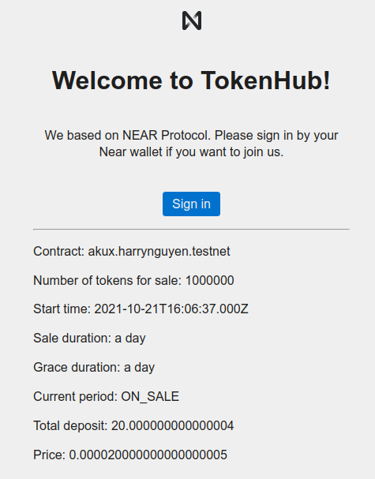
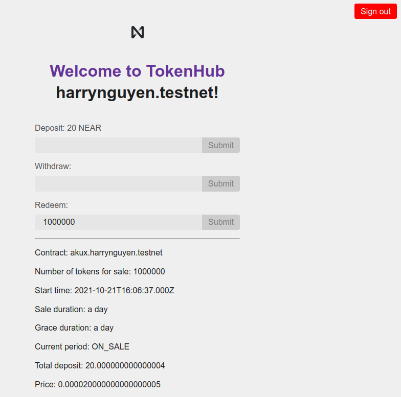

# TokenHub

## Introduction

Token Hub is my effort to help people **playing, learning and experiencing DeFi and tokenized economy** all the way down. You can **create your own token**, and then experience interesting DeFi things around it: **launch a sale for your token**, **swap it to others etc**. 

I'm a big fan of social tokens and strongly believe in the future of tokenized economy where every person and every community are valueable and can run themselves as their own businesses.

## Roadmap
| Stage         | Features                                                                      | Details                                                                                                                                                                                                                                                                          | Status   |
|---------------|-------------------------------------------------------------------------------|----------------------------------------------------------------------------------------------------------------------------------------------------------------------------------------------------------------------------------------------------------------------------------|----------|
| Simple IDO    | <ul> <li>Prototype UI/UX</li>  <li>Token sale on website</li> </ul>           | A simple UI for **token sale**                                                                                                                                                                                                                                                   | **DONE** |
| Token Factory | <ul> <li>User-defined tokens</li> <li>Simple predefined tokenomics</li> </ul> | Users can **create their own tokens**.  Some predefined rules in the tokenomics to avoid abuse:  <ul> <li>Total supply: 100,000,000</li> <li>Initial release to owner: 20,000,000 (20%)</li> <li>Unlock time for the rest: 3 years</li> <li>10% taken by TokenHub</li> </ul> | UNDONE   |
| Simple DEX    | <ul> <li>Liquidity pool</li> <li>Token swap</li> </ul>                        | Creating predefined pools allowing users to **swap their tokens with others**. Prioritization for tokens launched here                                                                                                                                                           | UNDONE   |

## Screenshots

